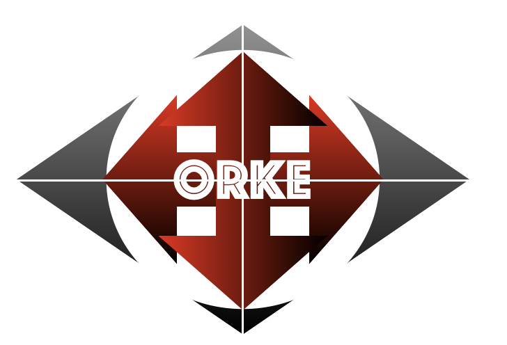
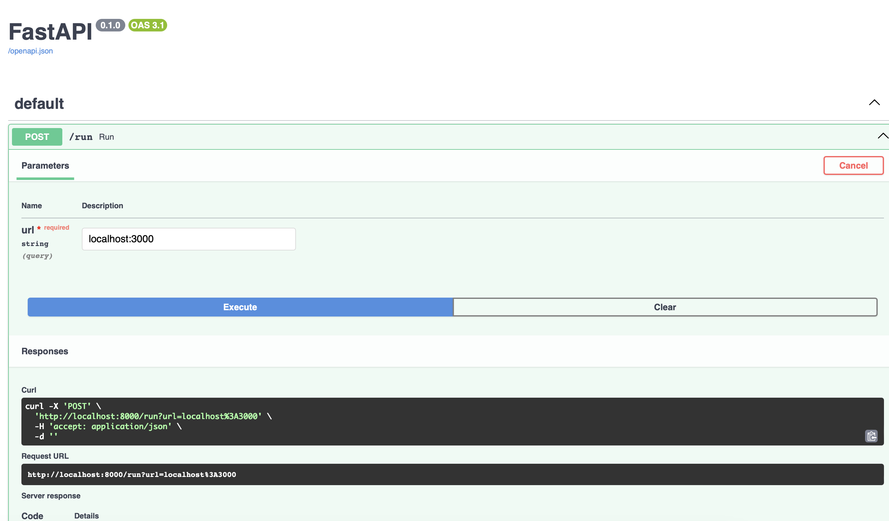
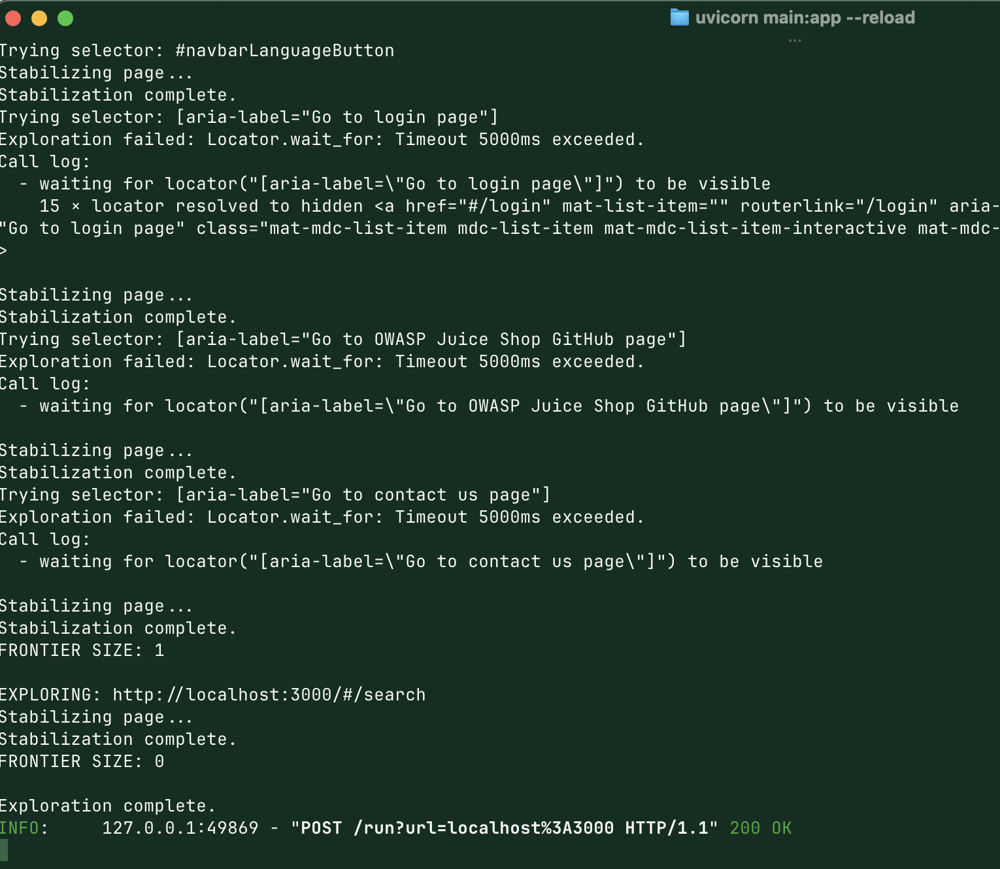
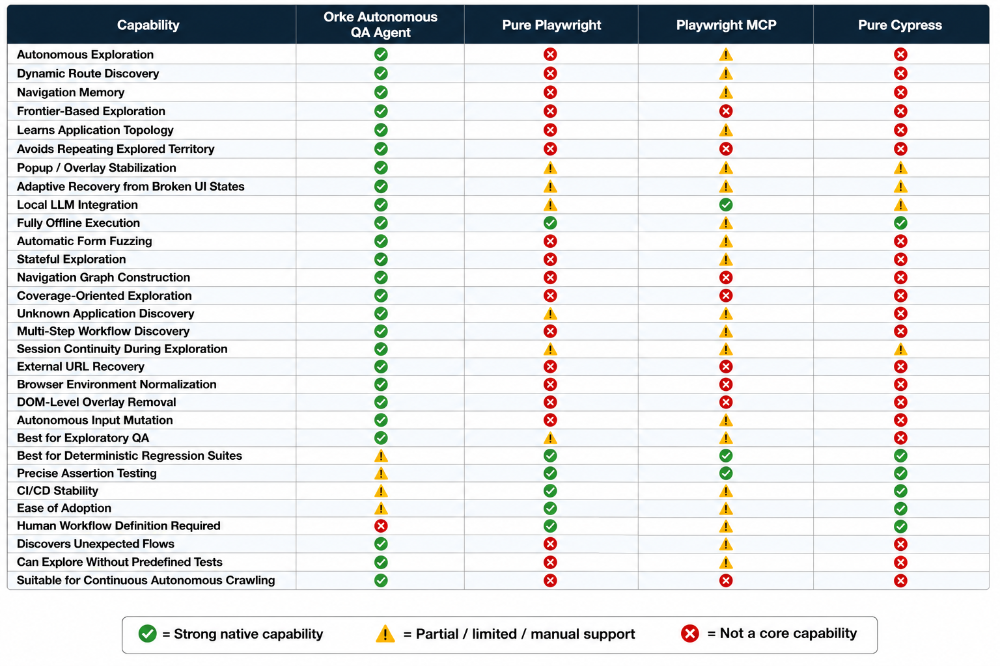

   

# Orke Autonomous QA Agent



An autonomous browser QA agent that explores a running web application, discovers new pages and workflows, fuzzes inputs, detects UI failures, and builds a navigation graph dynamically using Playwright + FastAPI + local LLMs through Ollama.



The system behaves less like a static Playwright test suite and more like an exploratory browser crawler with memory, stabilization, navigation recovery, and frontier-based state exploration.



This site was tested against the [OWASP Juice Web Shop](https://owasp.org/www-project-juice-shop/).

Traditional QA automation is:

```text
scripted
fragile
deterministic
```

This project explores a different direction:

```text
stateful
exploratory
adaptive
autonomous
```

The goal is not merely to execute tests.

The goal is to map and explore application behavior space.

---

# Features

## Autonomous Browser Exploration

The agent:

- Launches a real Chromium browser
- Explores visible UI elements
- Discovers new pages dynamically
- Builds a navigation graph
- Tracks visited routes
- Avoids repeated exploration loops
- Recovers from popups and overlays

---

## Frontier-Based Exploration

Instead of recursively looping forever through the same flows, the system:

- Discovers new navigation territory
- Queues unexplored pages
- Prioritizes novel states
- Avoids already-explored destinations
- Tracks navigation outcomes globally

Example:

```text
Homepage
 ├── Login
 ├── Contact
 ├── About
 └── Basket
```

Each route is explored once globally.

---

## Popup / Overlay Stabilization

The stabilizer automatically removes:

- Cookie banners
- Hover dialogs
- Angular overlays
- Material dialogs
- Tooltips
- Intro popups
- Translation prompts
- High z-index floating elements

This dramatically improves automation reliability.

---

## Local LLM Support via Ollama

The system works entirely locally.

No OpenAI API key required.

Supported through:

- Ollama
- Local models
- Offline execution

---

## Comparison Table



---
# Architecture

```text
FastAPI
   ↓
Agent
   ↓
Playwright Browser
   ↓
Frontier Explorer
   ↓
Navigation Graph + Memory
   ↓
Bug Detection + Stabilization
```

---

# Tech Stack

- Python
- FastAPI
- Playwright
- Ollama
- Chromium
- Local LLMs
- Async browser automation

---

# Installation

---

# 1. Clone Repository

```bash
git clone <your_repo_url>

cd orke/backend
```

---

# 2. Create Python Environment

Recommended:

```bash
conda create -n orke python=3.11

conda activate orke
```

---

# 3. Install Dependencies

```bash
pip install fastapi uvicorn playwright requests ollama
```

---

# 4. Install Playwright Browsers

```bash
playwright install
```

---

# 5. Install Ollama

## macOS

```bash
brew install ollama
```

## Linux

```bash
curl -fsSL https://ollama.com/install.sh | sh
```

Official site:

https://ollama.com

---

# 6. Start Ollama

```bash
ollama serve
```

---

# 7. Pull a Model

Recommended:

```bash
ollama pull qwen2.5-coder:7b
```

You may also use:

```bash
ollama pull mistral
ollama pull llama3
ollama pull codellama
```

---

# 8. Verify Ollama

```bash
curl http://localhost:11434/api/tags
```

You should see installed models returned.

---

# Running the Demo App

Example using Juice Shop:

```bash
docker run --rm -p 3000:3000 bkimminich/juice-shop
```

Or run locally via Node.

Verify:

```text
http://localhost:3000
```

---

# Running the QA Agent

Start FastAPI:

```bash
uvicorn main:app --reload
```

Server:

```text
http://127.0.0.1:8000
```

Swagger UI:

```text
http://127.0.0.1:8000/docs
```

---

# Running Exploration

POST:

```text
POST /run?url=http://localhost:3000
```

Example using curl:

```bash
curl -X POST \
"http://127.0.0.1:8000/run?url=http://localhost:3000"
```

---

# What Happens During Execution

The agent:

1. Launches Chromium
2. Stabilizes the page
3. Removes overlays/popups
4. Extracts interactive elements
5. Explores navigation paths
6. Fills forms automatically
7. Detects new routes
8. Builds exploration memory
9. Avoids repeated territory
10. Logs failures and transitions

---

# Example Console Output

```text
EXPLORING: http://localhost:3000

Trying selector: #navbarAccount

NEW TERRITORY:
http://localhost:3000/#/login

Trying selector:
[aria-label="Go to login page"]

Trying selector:
input[type="email"]

Trying selector:
input[type="password"]

Skipping known route:
#aboutButton -> /about
```

---

# Example API Result

```json
{
  "visited_pages": [
    "http://localhost:3000",
    "http://localhost:3000/#/login",
    "http://localhost:3000/#/contact"
  ],
  "total_pages": 3,
  "transitions": [
    {
      "from": "http://localhost:3000",
      "to": "http://localhost:3000/#/login",
      "action": "#navbarAccount"
    }
  ]
}
```

---

# Core Concepts

---

## Stabilization

The system continuously normalizes the browser environment:

- removes overlays
- dismisses dialogs
- handles floating UI
- clears modal blockers

Without stabilization, autonomous exploration becomes unreliable.

---

## Frontier Exploration

The explorer behaves like a graph search algorithm.

Instead of:

```text
click everything forever
```

it performs:

```text
discover new territory only
```

This dramatically improves:
- coverage
- speed
- reliability

---

## Navigation Memory

The agent remembers:

- visited pages
- explored actions
- known navigation routes
- navigation outcomes

This prevents endless loops.

---

# Limitations

Current system limitations:

- No visual ML
- No semantic understanding of workflows
- No reinforcement learning
- No auth/session strategy yet
- No multi-tab orchestration
- No network traffic analysis yet

---

# Future Improvements

Potential future enhancements:

- Reinforcement learning exploration
- Semantic route classification
- Screenshot-based UI understanding
- Console/network error analysis
- Coverage scoring
- Parallel browser agents
- Graph visualization
- Stateful replay
- Multi-user session exploration
- Security fuzzing
- GraphQL/API discovery

---
# Troubleshooting

---

## Playwright Browser Missing

```bash
playwright install
```

---

## Ollama Not Running

```bash
ollama serve
```

---

## Port Already In Use

Change ports:

```bash
uvicorn main:app --port 8001
```

---

## Overlay Issues

Improve selectors in:

```text
stabilizer.py
```

---

## Infinite Exploration Loops

Check:

```text
memory.py
frontier_explorer.py
```

The explorer should skip:
- explored pages
- explored destinations
- repeated navigation routes

---

# License

MIT